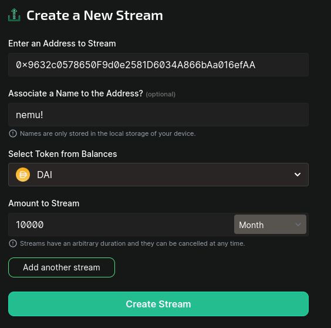

# Creating a Stream

You can create a stream by clicking this button or going to [https://llamapay.io/create](https://llamapay.io/create)

Input payee information and amount, then you can create a stream!

